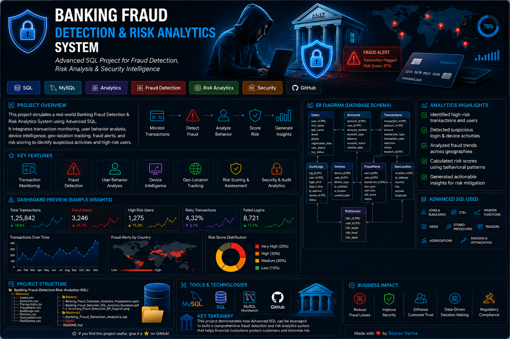
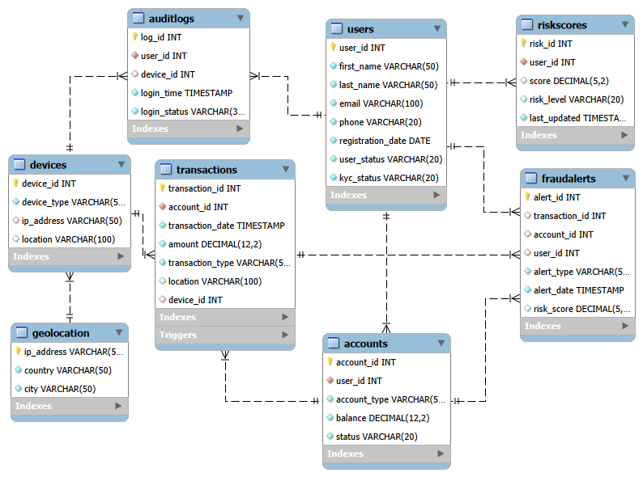

<p align="center">
  ## 🏦 Banking Fraud Detection & Risk Analytics System
</p>


<p align="center">
  
</p>

<p align="center">
  
  
  
  
  
</p>

---
## 📌 Project Overview

This project demonstrates how Advanced SQL can be used to design, manage, and analyze a real-world Banking Fraud Detection & Risk Analytics System.

The system simulates modern banking operations by integrating:

- 💳 Transaction Monitoring
- 🚨 Fraud Detection
- 📊 Risk Analytics
- 🔐 Security Analytics
- 🌍 Geo-Location Intelligence
- 🧠 Behavioral Analytics
- ⚡ Advanced SQL Analytics

into a unified relational database architecture.

---

## 🚀 Project Objectives

### ✔ Key Goals

- **Transaction Intelligence** – Analyze and monitor financial transaction activity
- **Fraud Detection** – Detect suspicious and high-risk transactions
- **Risk Analytics** – Identify risky users, accounts, and behavioral patterns
- **Behavioral Monitoring** – Analyze suspicious login behavior
- **Device Intelligence** – Detect shared or suspicious devices
- **Geo-Location Analytics** – Analyze fraud activity across countries and cities
- **Security Analytics** – Monitor login failures and account abuse
- **Business Intelligence** – Generate insights using Advanced SQL

---

## 🗂 Database Schema Overview

| Table Name | Description |
|---|---|
| Users | Stores user profile, KYC, and account status details |
| Accounts | Stores banking account information and balances |
| Transactions | Stores transaction activity and payment records |
| FraudAlerts | Stores suspicious transaction alerts and fraud risk data |
| AuditLogs | Stores login activity and security-related events |
| Devices | Stores device and IP address information |
| GeoLocation | Stores IP-based country and city mapping |
| RiskScores | Stores user-level fraud risk scores and classifications |

---

# 🖼 Project Preview

## 📌 ER Diagram

<p align="center">
  
</p>

---

## 📊 SQL Analytics Questions

This repository also includes a dedicated PDF containing all section-wise SQL analytics questions used in the project.

📌 **Path:**  
`Reports/Banking_Fraud_Detection_SQL_Analytics_Questions.pdf`

---

## 📁 Folder Structure

```text
Banking-Fraud-Detection-Risk-Analytics-SQL/
│
├── Datasets/
│   ├── Accounts.csv
│   ├── AuditLogs.csv
│   ├── Devices.csv
│   ├── FraudAlerts.csv
│   ├── GeoLocation.csv
│   ├── RiskScores.csv
│   ├── Transactions.csv
│   └── Users.csv
│
├── Project_Banner/
│   └── Banking_Fraud_Detection_Banner.png
│
├── Reports/
│   ├── Banking_Fraud_Detection_Analytics_Presentation.pptx
│   ├── Banking_Fraud_Detection_SQL_Analytics_Questions.pdf
│   └── Banking_Fraud_Detection_ER_Diagram.png
│
├── Workbench/
│   └── Banking_Fraud_Detection_Analytics.sql
│
├── LICENSE
│
└── README.md
```

---

# 📊 Analytics & Business Insights

## 👤 User & Account Analytics

- Users owning multiple accounts
- High-value banking customers
- Account balance analysis
- Suspended & dormant user analysis
- Account status distribution

---

## 💳 Transaction Analytics

- Total transaction volume analysis
- Monthly transaction trends
- High-value transaction detection
- Geo-based transaction activity analysis
- Transaction type distribution

---

## 🚨 Fraud & Risk Analytics

- High-risk user detection
- Fraud alert analysis
- Suspicious transaction monitoring
- Country-wise fraud analysis
- Fraud percentage calculation
- Device-based fraud analytics

---

## 🔐 Security & Behavioral Analytics

- Failed login analysis
- Suspicious device tracking
- Login behavior monitoring
- Multi-location user activity analysis
- Peak login activity analysis

---

## ⚡ Advanced SQL Concepts Implemented

<p align="center">
  
  
  
  
  
  
  
</p>

---

## ⭐ Key Recommendations

### 1️⃣ Strengthen Monitoring for High-Value Transactions
Large transaction amounts showed significantly higher fraud risk scores and suspicious activity patterns.

### 2️⃣ Improve Behavioral Authentication Systems
Users with repeated failed login attempts demonstrated elevated fraud probability.

### 3️⃣ Enhance Device Intelligence Monitoring
Devices shared across multiple users were associated with suspicious transaction behavior.

### 4️⃣ Increase Geo-Location-Based Fraud Monitoring
Foreign transactions contributed disproportionately to fraud alerts and elevated risk scores.

### 5️⃣ Apply Additional Validation for Dormant Accounts
Dormant and suspended users performing transactions may indicate potential account compromise or fraud activity.

---

## ▶️ How to Run the Project

### Step 1 — Import CSV Datasets

Import all CSV files into MySQL Workbench using the Import Wizard.

### Step 2 — Run SQL Script

Execute:

```text
Workbench/Banking_Fraud_Detection_Analytics.sql
```

This SQL script contains:
- Database Creation
- Table Creation (DDL)
- Data Insertion (DML)
- Advanced SQL Queries
- Views
- Stored Procedures
- Triggers
- Indexes

---

### Step 3 — View Reports

Open:

```text
Reports/
```

Files included:
- Banking_Fraud_Detection_Analytics_Presentation.pptx
- Banking_Fraud_Detection_SQL_Analytics_Questions.pdf
- Banking_Fraud_Detection_ER_Diagram.png

---

## 🛠 Technologies Used

- MySQL / SQL
- MySQL Workbench
- Relational Database Design
- ER Diagram Modeling
- Git & GitHub
- CSV Dataset Integration

---

## 🧠 Challenges Faced

- Designing a normalized banking fraud detection schema
- Managing multiple table relationships and foreign keys
- Simulating realistic fraud and transaction scenarios
- Implementing behavioral and geo-location analytics
- Handling advanced SQL analytics and fraud intelligence queries
- Automating fraud alert generation using triggers
- Building scalable and analytics-oriented database architecture

---

## 📘 SQL Concepts Covered

- Primary & Foreign Keys
- Data Normalization (1NF, 2NF, 3NF)
- INNER JOIN, LEFT JOIN & Multi-Table Joins
- GROUP BY, HAVING & Aggregate Functions
- Subqueries & Correlated Subqueries
- Common Table Expressions (CTEs)
- Window Functions (RANK, LAG)
- Views, Stored Procedures & Triggers
- CASE Statements & Business Logic
- Query Optimization & Indexing
- ER Modeling & Relational Design

---

## 🌍 Real-World Applications

This project demonstrates practical applications of SQL in:

- Banking Analytics
- Fraud Detection Systems
- Financial Risk Monitoring
- Security Analytics
- Behavioral Analytics
- Transaction Intelligence Platforms
- Business Intelligence Reporting
- Fraud Investigation Systems

---

## 📝 Conclusion

The Banking Fraud Detection & Risk Analytics System demonstrates how Advanced SQL can be applied to solve real-world financial monitoring and fraud detection challenges through scalable relational database design and analytical querying.

By integrating transaction intelligence, fraud analytics, behavioral monitoring, security analysis, geo-location tracking, and risk scoring into a unified database architecture, this project simulates a modern banking analytics environment used in financial institutions and fraud monitoring systems.

The project showcases practical implementation of:
- Advanced SQL analytics
- Relational database modeling
- Fraud detection logic
- Risk-based analysis
- Behavioral intelligence
- Security monitoring
- Business intelligence reporting

using technologies and concepts such as:
- Joins & Aggregations
- Common Table Expressions (CTEs)
- Window Functions
- Subqueries
- Views
- Stored Procedures
- Triggers
- Query Optimization
- Indexing


The system serves as a complete end-to-end SQL analytics solution that reflects real-world applications of database systems in banking, fraud intelligence, and financial risk management.

---

## 📄 License

All Rights Reserved.

This project and its contents are the intellectual property of the author.

No part of this project may be copied, modified, distributed, reproduced, or used in any form without explicit written permission from the author.

---

<p align="center">
 ⭐ Passionately built to showcase Advanced SQL, fraud analytics, and real-world banking intelligence systems. Thank you for exploring this project — your support, feedback, and suggestions are always appreciated!
</p>
